# GPT From Scratch

A lightweight implementation of a **GPT-style Decoder-Only Transformer** built completely from scratch using **PyTorch**. This project demonstrates the complete workflow of training and generating text using a Transformer architecture without relying on any pre-trained models or external APIs.

---

## Features

* Decoder-Only GPT Architecture
* Character-Level Tokenizer
* Multi-Head Self-Attention
* Transformer Decoder Blocks
* Feed Forward Network
* Positional Embeddings
* Autoregressive Text Generation
* Checkpoint Saving & Loading
* Modular Project Structure
* Streamlit Web Interface

---

## System Architecture

```mermaid
flowchart LR

A["Input Dataset"] --> B["Character Tokenizer"]
B --> C["Training Dataset"]
C --> D["Mini Batch Loader"]

D --> E["Token Embedding"]
E --> F["Position Embedding"]
F --> G["Transformer Decoder"]

subgraph Decoder
H["Multi-Head Self Attention"]
I["Feed Forward Network"]
J["Layer Normalization"]
end

G --> H
H --> I
I --> J

J --> K["Language Model Head"]
K --> L["Cross Entropy Loss"]
L --> M["Backpropagation"]
M --> N["AdamW Optimizer"]
N --> O["Checkpoint"]

O --> P["Inference"]
P --> Q["Generated Text"]
```



---

## Workflow

```text
Input Dataset
      │
      ▼
Character Tokenization
      │
      ▼
Train / Validation Split
      │
      ▼
Mini Batch Generation
      │
      ▼
Embedding Layer
      │
      ▼
Transformer Decoder
      │
      ├── Multi-Head Self Attention
      ├── Feed Forward Network
      └── Layer Normalization
      │
      ▼
Language Model Head
      │
      ▼
Cross Entropy Loss
      │
      ▼
Backpropagation
      │
      ▼
AdamW Optimizer
      │
      ▼
Save Checkpoint
      │
      ▼
Load Model
      │
      ▼
Generate Text
```

---

## Project Structure

```text
GPT-From-Scratch/
│
├── README.md
├── requirements.txt
├── train.py
├── generate.py
├── config.py
│
├── data/
│   └── input.txt
│
├── models/
│   ├── attention.py
│   ├── block.py
│   ├── feedforward.py
│   └── gpt.py
│
├── utils/
│   ├── tokenizer.py
│   ├── dataset.py
│   └── checkpoint.py
│
├── checkpoints/
│
├── outputs/
│
└── app.py
```

---

## Installation

Clone the repository

```bash
git clone https://github.com/yourusername/GPT-From-Scratch.git
cd GPT-From-Scratch
```

Install dependencies

```bash
pip install -r requirements.txt
```

---

## Dataset

Download the Tiny Shakespeare dataset and place it inside

```text
data/input.txt
```

---

## Train the Model

```bash
python train.py
```

The trained model will be stored in

```text
checkpoints/latest.pt
```

---

## Generate Text

```bash
python generate.py
```

The generated output will be saved in

```text
outputs/generated.txt
```

---

## Run the Web Application

```bash
streamlit run app.py
```

Open the displayed local URL in your browser to interact with the model.

---

## Technologies Used

* Python
* PyTorch
* Streamlit

---

## Future Enhancements

* Byte Pair Encoding (BPE) Tokenizer
* Top-k Sampling
* Top-p Sampling
* Temperature Control
* Mixed Precision Training
* TensorBoard Integration
* Perplexity Evaluation
* Flash Attention
* KV Cache
* Beam Search

---

## Author

**Sourabh Vamdevan**


Interested in Machine Learning, Deep Learning, Natural Language Processing, Large Language Models, and Generative AI.
